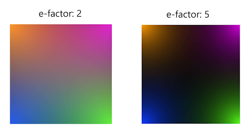

**VR Odors algorithm**

To compute a square virtual space with 4 different odors we created the `loc2odor` algorithm. This algorithm can position the odors in each corner of the virtual square, so that in extreme coordinates ((0,0), (1,0), (0,1), (1,1)), there is 100% of one's odor relative concentration. 

With this equation, we are able to control the duty cycle of electrical pulses given to the odor valves and simulate the olfactory 2D space.

Subsequently, every color in the figure below, represents an odor that its concentration fades as you move closer to the center. The e-factor is the extinction factor, which describes the extent of odor fading. The more distinct the odors, the bigger the e-factor and vice versa, if the fading is broader, the odors are more mixed up which is accomplished by having the e-factor below 5. e-factor is a small integer with varying values from 2 to 6: Sharper odor transitions happen when the e-factor is above 3 and vice versa, shallower changes are accomplished when its values are ranging from 3 to 1.

Figure: Exemplary olfactory spaces with different e-factors. Left: e-factor=2, Right: e-factor=5.

\
$ x_{dist} =  \dfrac{|odors_{x}  - x |}{space size} $

$ y_{dist} =  \dfrac{|odors_{y}  - y |}{space size} $

$ loc2odor = \bigg(1 - \sqrt{\dfrac{x_{dist}^2 +y_{dist}^2}{2}}\bigg) ^{100 * e-factor} $